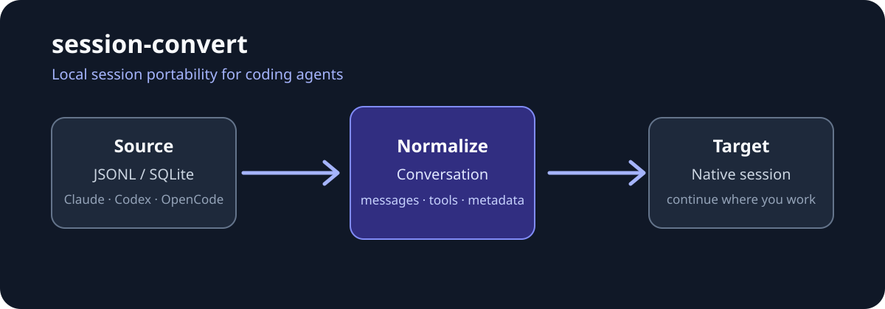

# session-convert

**Move an AI coding session between Claude Code, Codex CLI, and OpenCode without losing the conversation.**

[Docs](docs/README.md) · [Conversion reference](docs/CONVERSION.md) · [Русский](docs/README.ru.md)



When the useful context is in the wrong coding agent, session-convert reads the source session, maps it to a common conversation, and writes the target agent's native JSONL or SQLite format. It is an MCP server for local, user-owned session files—not a hosted sync service.

## What it does

- Converts all six directions between Claude Code, Codex CLI, and OpenCode.
- Reads Claude/Codex JSONL and current or legacy OpenCode SQLite layouts.
- Preserves text, tool calls/results, reasoning where available, images, metadata, and model names.
- Previews message counts, tool activity, and compatibility notes before writing.
- Also exposes a direct-path conversion API for known `.jsonl` or `.db` files.

## Install from source

There is no published package install documented here yet. For a source checkout, use Node.js 20+ and run:

```bash
git clone https://github.com/megamen32/session-convert.git
cd session-convert
npm ci
npm run build
```

Then point your MCP client at `dist/index.js`:

```json
{
  "mcpServers": {
    "session-convert": {
      "command": "node",
      "args": ["/absolute/path/to/session-convert/dist/index.js"]
    }
  }
}
```

## First conversion

Use `list_sessions` to find a session, `preview_conversion` to inspect the mapping, and `convert_session` to write it. `convert_by_path` is available when you already know the source file. The server accesses local session files using the permissions of the MCP client.

## Learn more

- [User guide and MCP tools](docs/README.md)
- [Formats, preservation, and limitations](docs/CONVERSION.md)
- [Verification and live smoke requirements](docs/TESTING.md)

## License

MIT
